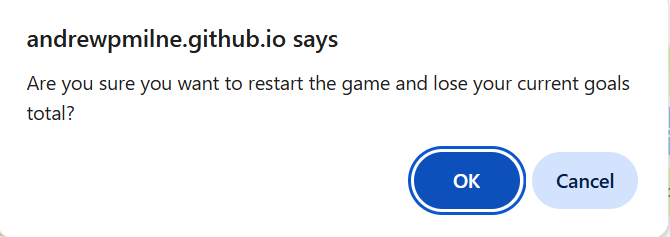
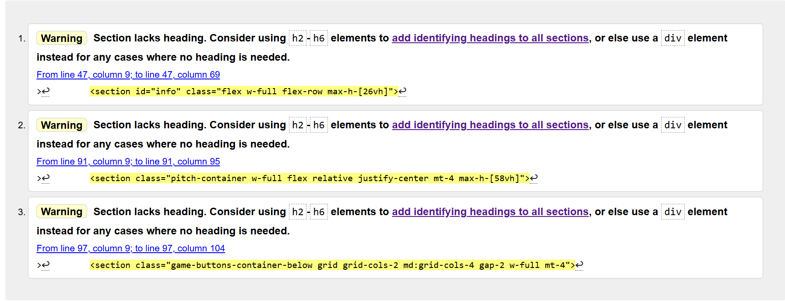

# project-two-xg-football-game #

## Code Institute Diploma In Full Stack Development - JavaScript unit ##

The XG football game website has been designed for two purposes. Firstly, to educate and inform about the concept of Expected Goals in football matches. It does this through an explanation on the rules page and through playing the game itself. Secondly, to entertain football fans and computer game fans with a fun, luck-based football simulation.

Click [this link](https://andrewpmilne.github.io/project-two-xg-football-game/) to visit the deployed version of the website. 

## User Stories ##

### Must Have ### 

### Should Have ###

### Could Have ### 

All the Must Have and Should Have User Stories were fully completed with all features included. Elements of the Could Have Story were completed. The game does use a modal to give you a score at the end to make competition with yourself possible in the game. This could easily be screenshotted and shared with friends to make competition amongst other people possible. Creating a more advanced leaderboard would be a further feature to extend this website in the future. 

## Features ##
This website includes a number of features to reach the aims of teaching about XG and providing an enjoyable gaming experience.

### Navbar and Footer ###
The navbar is simple to avoid distracting from the game itself. As a result, it did not need to have a dropdown menu. It does include:
- A Title (Football XG Game)
- A sound button to toggle sound on and off
- A link to go to the game page
- A link to go to the rules page

The footer is also kept simple for the same reasons. It includes: 
 - A Title (Football XG Game)
 - Copywrite information
 - A link to the author's GitHub page

### Welcome Modal ###
The welcome modal appears when the website is loaded <strong> for the first time </strong>. This is necessary as it would be annoying if it appeared every time the game was loaded (or, for example, when returning from the rules page). It gives a brief outline of the game to entice users. It gives the option of navigating straight to the game or to go to the rules page for more information. It also encourages users to turn the sound on as this aids overall user experience when playing.

### Rules Page ###
The rules page gives the user more information about XG as well as explaining the rules of the game. This page is kept simple to ensure users can gain the information they need as quickly as they can before experiencing the game itself.

### Information Section ###
This section was included on the top left of the screen as it is the key information players need to know when playing the game, particularly the number of goals they have scored and the time remaining so they know how long they have left. The statistics update as the game is being played. 

### Buttons ###
The buttons appear at the top in the middle on larger screens, but appear at the bottom (below the pitch) on smaller screens. This is because when holding a device such as a phone and being required to tap buttons, you do not want your hand to cover important information on the screen. The game buttons are grey at points in the game when they are disabled. When they are enabled, they appear green and a cursor hovering over them will change to the 'pointer' symbol. 

The start button changes message once a game has begun so that a player is aware that they will be restarting a game if they click on it. An alert also appears at this stage to ensure the player genuinely means to restart their game and lose their current score.

### Commentary ###
The commentary section was added towards the end of the project to aid user experience and make the movement of the ball in the game clearer, particularly for users not playing with sound on (where goals are indicated by crowd noise). The commentary changes depending on the button that has been pressed and the result that has occured.

### Pitch Image / Play Area ###
The pitch and football are images that represent the main play area of the game. Tailwind classes and CSS Flexbox are used to position them accurately. JavaScript and CSS transitions are used to move the ball across the screen when required.

### Sounds ###
Sound effects are a significant feature of the website as they aid the user experience by making it seem more realistically like a football match. As is best practice and industry standard, the sound is muted by default when the website first loads. The welcome modal encourages users to switch it on. The crowd noise, referee's whistle to signify the start and end of the game and cheers/ gasps add to the experience as well as making the gameplay clearer to users. 

### End Game Modal ###
JavaScript is used to ensure the game end modal appears at the end of the game. It is used to inform the user of their goals total (thus creating a competitive element to add to the experience) and give them the option of playing again or reading the rules. Correct pluralisation occurs depending on if 1 goal or multiple goals are scored.

### Features left to Implement ###
The website could benefit from a number of future features. 
- A leaderboard would be a very good feature to aid competitive play and is the final part of the 'Could Have' User Story.
- More sounds could be incorporated, such as crowd groaning when a move results in the ball returning to the start or more dramatic cheers if a goal has been scored from a greater distance.

## Design ##
### Planning ###
In the planning stage, flowcharts were created using Lucid Chart to design a rough outline of the user experience when playing the game and the 'flow' of functions through the JavaScript code.
 - User experience:

 

 - Functions 'flow':

 

### Appearance ###
-A simple 'mono' font was used throughout the project for ease of understanding and for the user to focus on the pitch (playing area).
-Colours that were clearly distinct from each other (lime and orange) were used to separate different areas of the website. This also allowed for text placed on top to be read easily and quickly.
-Grey was used to signify buttons that were inactive as this would be clear to the user.
-All buttons and links change colour when hovered over to indicate to the user what will happen if they are pressed.

## Testing ##
The website has been tested in different browsers:

- Chrome

- Edge

- Safari

The project is responsive and functions on all standard screen sizes, using Dev Tools device bar.

- The text in both pages is easily readable and understandable. Lighthouse was used to check for accessibility, including colour clashes.
- All external links open in new tabs.
- All links and buttons work.

### Gameplay ###
A significant amount of gameplay testing ('playtesting') was done to check for errors. This included:
- Trying 'illegal' moves such as a pass when 1m from the goal to ensure correct alerts appeared.
- Repeatedly pressing the same button to check that the computer 'learned' to defend against this move.
- Pressing buttons too quickly to check that buttons were disabling at the right times.
- Intentionally scoring 0 and 1 goals to check that the pluralisation was correct on the end game modal.
- Minimising the screen mid-movement to check that the ball continued to travel to the correct place.

### Sound ###
Sound adds a lot to the user experience of this game. However, it needed to be tested a great deal to avoid errors. These included:
- Ensuring that the sound toggle button started as muted and could be turned on and off.
- Ensuring that all sounds only played if the toggle button was on, including if it was changed within the middle of gameplay.
- Ensuring that the sound stopped if the screen was minimised.
- Ensuring that the crowd noise stopped at the end of the game, even if it had only started in the middle of gameplay due to being toggled on.
- Ensuring that sound worked on Safari, which processed the sounds differently to other browsers.

## Bugs ##
A number of bugs occured throughout the creation of this project:
- Linking Tailwind to the deployed version of this website did not work for a long time, and the issue did not occur in the live preview version. This period is reflected in a number of commits referring to changing the href as it was thought this was the issue. The bug was fixed when it was noticed that in GitHub (but not in VS Code) the JavaSCript folder name was incorrectly in uppercase lettering. This had previously been corrected in VS Code but had not automatically updated in GitHub. Once this was corrected, Tailwind worked as expected.
- A number of issues occured related to the sound effects in the website.
  - Initially, sound was continuing even if the screen was minimised. This was corrected in the JavaSCript code.
  - After this, the crowd sound would continue after the game had finished if the screen had been minimised at some point. This was corrected by ending the sound in the gameEndModal function.
  - As the crowd noise is continuous throughout the game it was not toggling on or off if the sound button was pressed mid-game. This was corrected by coding a loop the repeatedly checked if the sound button had been toggled to on or off. 
  - Finally, on testing it was discovered that the Safari browser did not initiate the sounds as other browsers did. This was fixed by briefly running the sounds earlier in the code so they would initiate at the correct times.

## Validation ##

### HTML ###
HTML was validated using the official W3C validator. 3 warnings (not errors) were found relating to sections being used without headings. Sections were used rather than divs to assist screen readers, however headings were not necessary and would detract from the gameplay. Therefore the code was not altered.

The Rules page HTML passed the validator with no errors or warnings.

### CSS ###
The style.css passed the W3C Jigsaw validation with no errors or warnings.

### JavaScript ###
jshint was used to validate the JS code. One warning (no errors) was found relating to a function being called within a loop. After consultation with the Code Institute tutors and vigorous testing, it was found that the code ran successfully despite this warning and changes were not required.

The following metrics were returned:
 - There are 23 functions in this file.
 - Functions with the largest signature take 2 arguments, while the median is 0.
 - The largest function has 32 statements, while the median is 9.
 - The most complex function has a cyclomatic complexity value of 17, while the median is 3.

### Accessibility ###
Accessibility was checked using Lighthouse on both the index and rules pages:
 - Index:

 

 - Rules:

 

 These results were particularly pleasing.

## Deployment ##
This section describes the process required to deploy this project using GitHub.
- Go to the Settings tab of your GitHub repo.
- On the left-hand sidebar, in the Code and automation section, select Pages.
  - Make sure:
    - Source is set to 'Deploy from Branch'.
    - Main branch is selected.
    - Folder is set to / (root).
- Under Branch, click Save.
- Go back to the Code tab. Wait a few minutes for the build to finish and refresh your repo.
- On the right-hand side, in the Environments section, click on 'github-pages'.
Click View deployment to see the live site.

The live site can be found here:
- https://andrewpmilne.github.io/project-two-xg-football-game/

## Technologies Used ##
- [HTML](https://developer.mozilla.org/en-US/docs/Web/HTML) was used as the foundation of the site.
- [CSS](https://developer.mozilla.org/en-US/docs/Web/css) - was used to add the styles and layout of the site.
- [CSS Flexbox](https://developer.mozilla.org/en-US/docs/Learn/CSS/CSS_layout/Flexbox) - was used in media queries and to style, including to position the football on top of the pitch.
- [Tailwind](https://tailwindcss.com/) - was used to style elements throughout the project, including ensuring responsiveness. 
- [Balsamiq](https://balsamiq.com/) was used to make wireframes for the website.
- [Lucid Chart](https://www.lucidchart.com/) was used to design flowcharts for the user experience and the flow of functions throughout the game.
- [VSCode](https://code.visualstudio.com/) was used as the main tool to write and edit code.
- [Git](https://git-scm.com/) was used for the version control of the website.
- [GitHub](https://github.com/) was used to host the code of the website and log notes in the design process.

## Credits ##
The following sites were used to assist with the project:
- https://tailwindcss.com/ (linked in the HTML code to aid design and responsiveness).
- https://fontawesome.com/ (linked in the HTML code for social media icons).
- https://stackoverflow.com/ (for assistance with code-related queries).
- https://www.w3.org/ (for guides and tutorials with specific code).
- https://chatgpt.com/ (for assistance with coding queries and for spotting syntax errors).

## Thanks ##
I would like to thank:
- My mentor, Juliia Konovalova, for help throughout the project, particularly for helping to identify the bugs relating to the sound.
- My friends, Carl Vatcha, Keith Newman and Jonny Perera for playtesting the game to look for bugs.
- My wife, Annabelle Milne, for support and looking after our kids whilst I completed this project!

